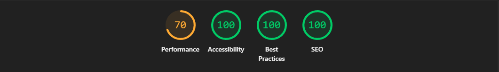

# Saurabh Jain - Portfolio

A responsive personal portfolio website showcasing my [interest, about me, experience, personal projects, technical skills, education background]. 

## Live Website

[Visit Portfolio](https://jainsaurabh033.github.io/Saurabh-Personal-Website/)

## Features

- Responsive design for desktop, tablet, and mobile
- Modern and clean user interface
- Hero section
- About section
- Experience section
- Project section
- Contact section
- Responsive navigation
- Smooth scrolling
- Optimized images and assets
- Accessible and semantic UI

---

## Tech Stack

### Frontend

- React
- TypeScript / JavaScript
- HTML5
- CSS

### Build Tools

- Vite
- npm

### Development Tools

- Git
- GitHub
- VS Code

---



---

# Getting Started

Follow the steps below to run the portfolio locally on your machine.

## Prerequisites

Make sure the following software is installed on your machine

### Node.js

Node.js version 20 or higher is recommended.

Check your installed version:

```bash
node --version
```

### npm

npm is installed automatically with Node.js

Check your installed version:

```bash
npm --version
```

### Git

Check your Git installation

```bash
git --version
```

If above commands return version numbers, your environment ready.

---

# Installation

## 1. Clone the repository

Clone the repository using Git:

```bash
git clone https://github.com/jainsaurabh033/Saurabh-Personal-Website
```

## 2. Navigate to the project directory

```bash
cd portfolio
```

## 3. Install dependencies

Install all the required project dependencies:

```bash
npm install
```

This will install the packages listed in `package.json`.

# Run the Application

Start the development server:

```bash
npm run dev
```

After the server starts, open the URL showin in your terminal

For a typical Vite application, it will be:

```text
http://localhost:5173
```

The application will automatically reload when you make changes to the source code.

---

# Build for Production

To create an optimized production build:

```bash
npm run build
```

The production files will be generated in the `dist` directory.

---

# Preview Production Build

You can preview the production build locally using:

```bash
npm run preview
```

Then open the URL provided by Vite in your terminal.

---

# License

This project is licensed under the MIT License

You are free to use the structure and ideas from this project for learning and personal purposes.
